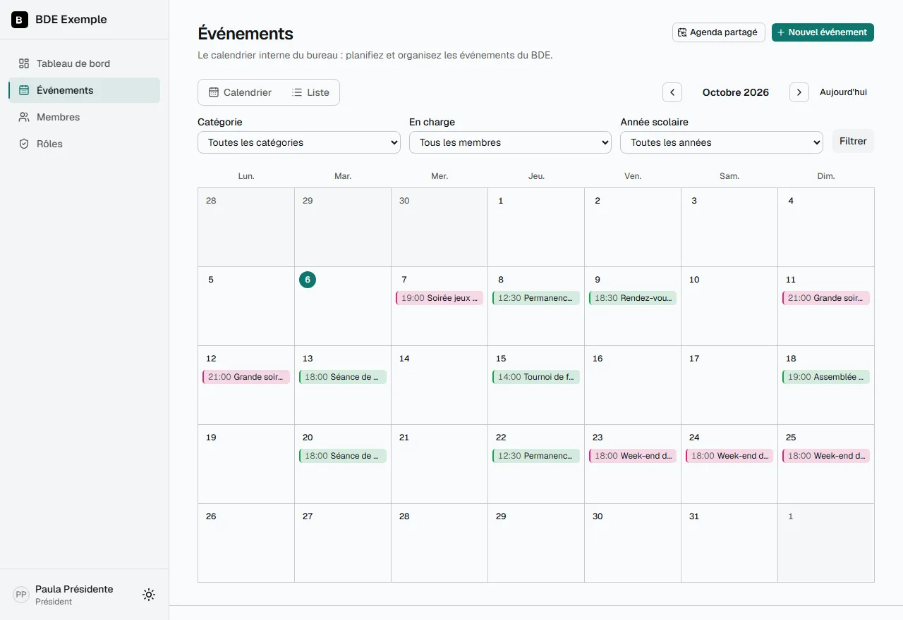
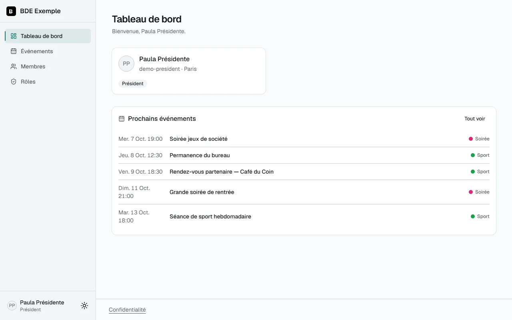
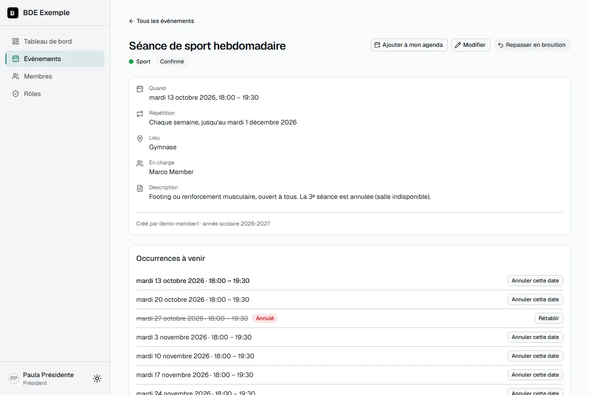
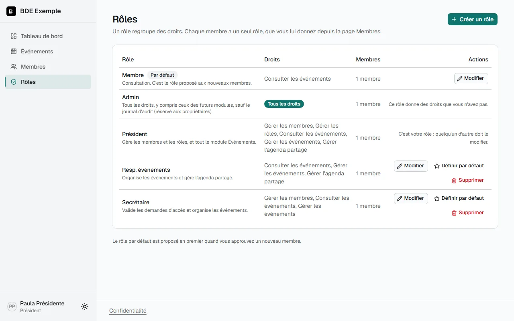
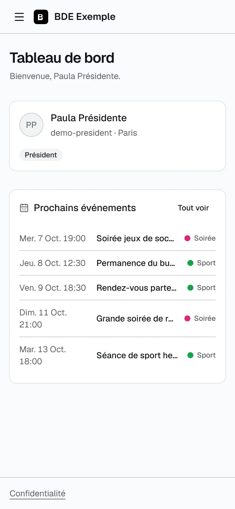

# BDE_Network

[🇬🇧 English](README.md) · 🇫🇷 Français

**Une plateforme open source, auto-hébergée, pour gérer un Bureau Des Étudiants (BDE) d'une école 42.** Les membres se connectent avec leur compte 42, le bureau distribue des rôles sur mesure, et
les événements de l'association vivent dans un calendrier partagé auquel chacun peut s'abonner
depuis Google Agenda, Outlook ou Apple Agenda.

Chaque BDE fork ce dépôt et fait tourner **sa propre instance** : sa base de données, sa
configuration, sa propre application OAuth 42. Rien n'est partagé entre les instances.

## Ce que la plateforme fait aujourd'hui

- **Connexion avec 42 uniquement**, aucun mot de passe à gérer. Les nouveaux membres attendent
  d'être approuvés : le bureau les valide et choisit leur rôle. Possibilité de n'autoriser que
  certains campus.
- **Rôles et droits sur mesure.** Chaque BDE crée ses rôles (Président, Trésorier, Responsable
  événements…) et coche exactement ce que chacun peut faire. Nul ne peut donner un droit qu'il n'a
  pas, ni modifier son propre rôle : l'escalade de privilèges est bloquée côté serveur et testée
  ([détails](docs/roles.md)). Le propriétaire se définit dans le fichier de configuration et a
  tous les droits.
- **Module Événements** : calendrier (vues mois et liste), catégories colorées, événements
  récurrents (chaque semaine, toutes les deux semaines, chaque mois), brouillons invisibles tant
  qu'ils ne sont pas confirmés, personnes en charge, annulation d'une seule date d'une série
  ([guide](docs/events.md)).
- **Agenda synchronisé.** Chaque membre a un lien d'abonnement personnel, et le bureau peut publier
  **un seul lien pour tout le BDE** à coller une fois dans un agenda Google ou Outlook partagé. Les
  deux se mettent à jour tout seuls.
- **Notifications** par e-mail, Discord ou Slack, réglées par type d'événement : événement
  confirmé, rappel la veille, nouvelle demande d'accès, approbation, retrait.
- **Journal d'audit** des actions sensibles (propriétaires uniquement), **export RGPD** de ses
  propres données et politique de confidentialité.
- Interface en **français et en anglais**, thèmes clair et sombre, votre couleur d'accent et votre
  logo, utilisable sur téléphone.
- **Simple à exploiter** : un seul `docker compose up`, migrations de base appliquées au
  démarrage, scripts de sauvegarde et de restauration qui ne demandent que Docker, en-têtes de
  sécurité, point de contrôle de santé.

|                                                   |                                                                        |
| ------------------------------------------------- | ---------------------------------------------------------------------- |
|  |                  |
|    |  |

## Feuille de route

Modules métier prévus, **pas encore disponibles** : **Finances** (budget et dépenses)
et **Réunions** (ordres du jour et comptes rendus). La plateforme est construite pour qu'un module
apporte ses propres droits sans toucher au cœur ([comment](docs/architecture.md)).

## Démarrage rapide

Il vous faut [Docker](https://www.docker.com/products/docker-desktop/) et Git, sous Windows,
Linux ou macOS. Pas besoin de Node.js.

1. **Clonez** le dépôt : `git clone https://github.com/<votre-fork>/BDE_Network.git`, puis `cd BDE_Network`.
2. **Créez une application OAuth 42** sur <https://profile.intra.42.fr/oauth/applications/new>
   (scope `public`) avec l'URL de redirection `http://localhost:3000/api/auth/callback/42-school`
   pour un essai local. Gardez son UID et son secret.
3. **Copiez `.env.example` vers `.env`** et remplissez-le : un mot de passe de base de données,
   l'UID et le secret, et un `AUTH_SECRET` (32 caractères ou plus) obtenu avec
   `docker run --rm alpine sh -c "head -c 32 /dev/urandom | base64"`.
4. **Éditez `bde.config.yml`** : le nom du BDE, les campus autorisés, et **votre login 42** dans
   `auth.owners`.
5. **Lancez** `docker compose up --build -d`, ouvrez <http://localhost:3000> et connectez-vous avec
   42 : votre login est propriétaire.

Le guide d'installation complet, pas à pas (pour le bureau, puis pour la personne qui prépare le
serveur), la mise en production avec HTTPS et les sauvegardes sont dans [docs/](docs/).

## Documentation

|                                                                                    |                                                                                        |
| ---------------------------------------------------------------------------------- | -------------------------------------------------------------------------------------- |
| [Installation](docs/installation.md)                                               | deux parcours : pour le bureau (aucune notion technique) et pour la personne technique |
| [Configuration](docs/configuration.md)                                             | tous les réglages de `bde.config.yml` et `.env`                                        |
| [Guide utilisateur](docs/user-guide.md)                                            | pour les membres                                                                       |
| [Rôles et droits](docs/roles.md)                                                   | le modèle, les règles de sécurité, un exemple d'organisation                           |
| [Module Événements](docs/events.md)                                                | calendrier, synchronisation, rappels, notifications                                    |
| [Notifications](docs/notifications.md)                                             | e-mail, Discord (cartes), Slack ; le logo de l'expéditeur                              |
| [Déploiement](docs/deployment.md)                                                  | VPS, Docker Compose, proxy HTTPS, sauvegardes                                          |
| [Guide contributeur](docs/contributing-guide.md) · [Design system](docs/design.md) | pour les développeurs                                                                  |

## Essayer les rôles chez soi

`docker compose -f docker-compose.dev.yml up` lance l'application avec des comptes et des
événements de démonstration. Mettez `ENABLE_DEV_IMPERSONATION=true` dans `.env`, connectez-vous en
propriétaire et utilisez le bandeau en haut de page pour voir la plateforme « en attente » ou avec
n'importe quel rôle (développement uniquement, jamais en production).

## Stack technique

Next.js 15 (App Router) · TypeScript strict · PostgreSQL · Prisma 7 · Tailwind CSS v4 ·
shadcn/ui · NextAuth v5 (beta, version épinglée) · next-intl · Docker Compose

## Contribuer et sécurité

Voir [CONTRIBUTING.md](CONTRIBUTING.md) et le [Code de conduite](CODE_OF_CONDUCT.md). Pour
signaler une faille, lisez [SECURITY.md](SECURITY.md) — merci de ne pas ouvrir d'issue publique.
Les changements sont listés dans le [CHANGELOG](CHANGELOG.md).

## Licence

[MIT](LICENSE)
