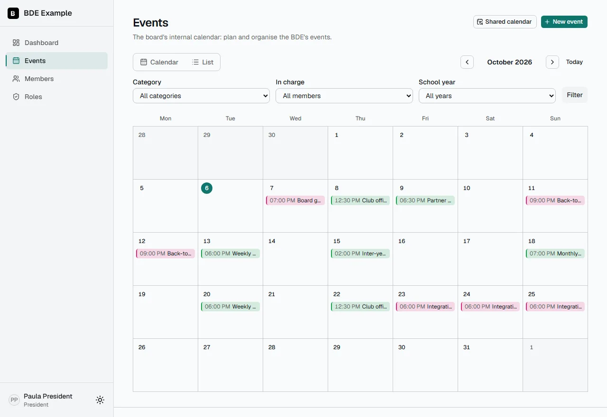
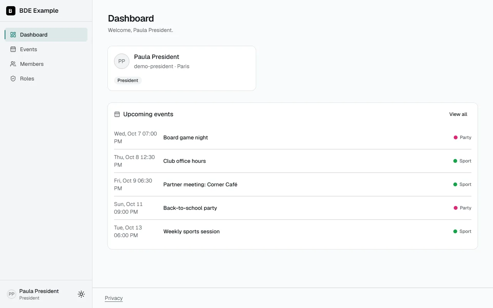
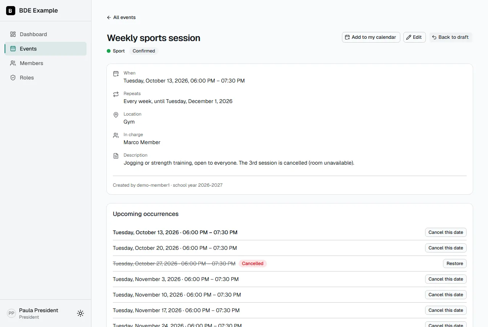
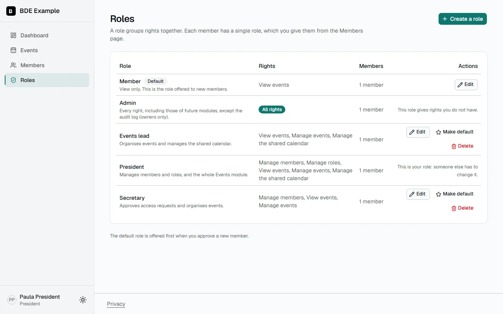
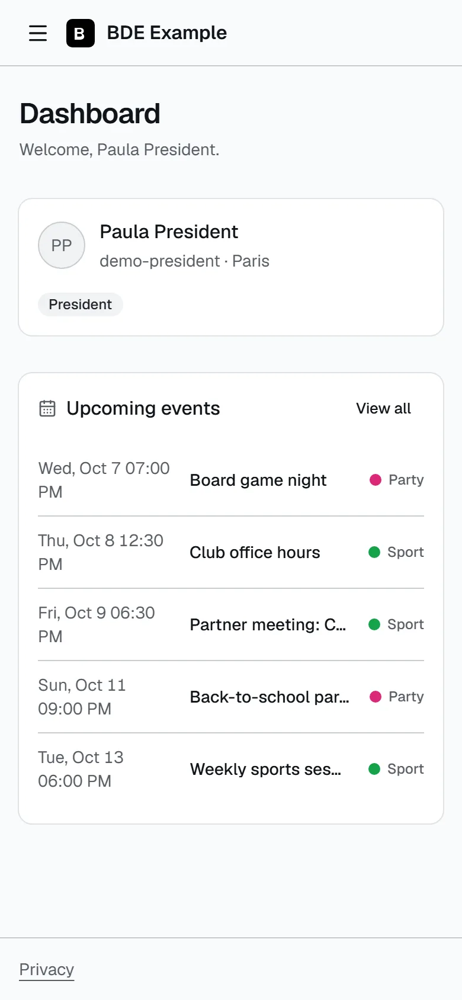

# BDE_Network

🇬🇧 English · [🇫🇷 Français](README.fr.md)

**An open-source, self-hosted platform to run a student association (_Bureau Des Étudiants_, BDE)
at a 42 school.** Members sign in with their 42 account, the board gives out custom roles, and the
club's events live in one shared calendar that everyone can subscribe to from Google Calendar,
Outlook or Apple Calendar.

Each BDE forks this repository and runs **its own instance**: its own database, its own
configuration, its own 42 OAuth application. Nothing is shared between instances.

## What it does today

- **Sign in with 42 only**, no password to manage. New members wait for approval; the board
  approves them and picks a role. Restrict sign-in to some campuses.
- **Custom roles and permissions.** Each BDE creates its own roles (President, Treasurer, Events
  lead…) and ticks exactly what each one may do. Nobody can hand out a right they do not hold, or
  change their own role: escalation is blocked on the server and tested ([details](docs/roles.md)).
  The owner is set in the configuration file and holds every right.
- **Events module**: a calendar (month and list views), categories with colours, recurring events
  (weekly, every two weeks, monthly), drafts that stay private until confirmed, people in charge,
  and cancelling a single date of a series ([guide](docs/events.md)).
- **Calendar sync.** Every member gets a personal subscription link, and the board can publish
  **one link for the whole BDE** to paste once into a shared Google or Outlook calendar. Both stay up
  to date by themselves.
- **Notifications** by email, Discord or Slack, configured per event type: a confirmed event, a
  reminder the day before, a new access request, an approval, a removal.
- **Audit log** of sensitive actions (owners only), **GDPR** export of one's own data and a privacy
  policy.
- **French and English** interface, light and dark themes, your accent colour and logo, usable on a
  phone.
- **Easy to run**: one `docker compose up`, database migrations applied on start, backup and
  restore scripts that need only Docker, security headers, a health endpoint.

|                                               |                                                                     |
| --------------------------------------------- | ------------------------------------------------------------------- |
|    |       |
|  |  |

## Roadmap

Planned business modules, not available yet: **Finances** (budget and expenses) and
**Meetings** (agendas and minutes). The platform is built so that a module brings its own
permissions without touching the core ([how](CLAUDE.md)).

## Quick start

You need [Docker](https://www.docker.com/products/docker-desktop/) and Git, on Windows, Linux or
macOS. No Node.js.

1. **Clone** the repository: `git clone https://github.com/<your-fork>/BDE_Network.git`, then `cd BDE_Network`.
2. **Create a 42 OAuth application** at <https://profile.intra.42.fr/oauth/applications/new>
   (scope `public`) with the redirect URL
   `http://localhost:3000/api/auth/callback/42-school` for a local try-out. Keep its UID and secret.
3. **Copy `.env.example` to `.env`** and fill it in: a database password, the UID and secret, and
   an `AUTH_SECRET` (32+ characters) from
   `docker run --rm alpine sh -c "head -c 32 /dev/urandom | base64"`.
4. **Edit `bde.config.yml`**: the BDE name, the allowed campuses, and **your 42 login** in
   `auth.owners`.
5. **Run** `docker compose up --build -d`, open <http://localhost:3000> and sign in with 42: your
   login is the owner.

The full, step-by-step installation guide (for the board and for the person who sets up the
server), the production deployment with HTTPS and the backups are in [docs/](docs/) — **currently
written in French**.

## Documentation

All in French for now; the interface and this page are bilingual.

|                                                                                   |                                                                                |
| --------------------------------------------------------------------------------- | ------------------------------------------------------------------------------ |
| [Installation](docs/installation.md)                                              | two paths: for the board (no technical knowledge) and for the technical person |
| [Configuration](docs/configuration.md)                                            | every setting of `bde.config.yml` and `.env`                                   |
| [User guide](docs/user-guide.md)                                                  | for the members                                                                |
| [Roles and permissions](docs/roles.md)                                            | the model, the security rules, an example organisation                         |
| [Events module](docs/events.md)                                                   | calendar, sync, reminders, notifications                                       |
| [Notifications](docs/notifications.md)                                            | email, Discord (cards), Slack; the sender's logo                               |
| [Deployment](docs/deployment.md)                                                  | VPS, Docker Compose, HTTPS reverse proxy, backups                              |
| [Contributor guide](docs/contributing-guide.md) · [Design system](docs/design.md) | for developers                                                                 |

## Try the roles on your machine

`docker compose -f docker-compose.dev.yml up` starts the app with demo accounts and demo events.
Set `ENABLE_DEV_IMPERSONATION=true` in `.env`, sign in as the owner and use the banner at the top
to see the platform as "waiting for approval" or as any role (development only, never in
production).

## Tech stack

Next.js 15 (App Router) · TypeScript (strict) · PostgreSQL · Prisma 7 · Tailwind CSS v4 ·
shadcn/ui · NextAuth v5 (beta, pinned version) · next-intl · Docker Compose

## Contributing and security

See [CONTRIBUTING.md](CONTRIBUTING.md) and the [Code of Conduct](CODE_OF_CONDUCT.md). To report a
vulnerability, read [SECURITY.md](SECURITY.md) — please do not open a public issue. Changes are
listed in the [CHANGELOG](CHANGELOG.md).

## License

[MIT](LICENSE)
