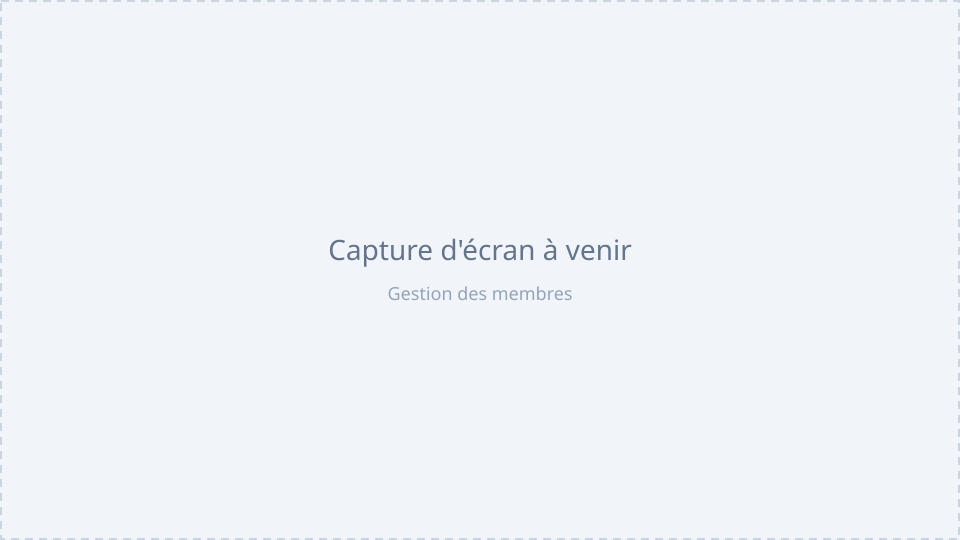

# BDE_Network

Plateforme de gestion open source pour les Bureaux Des Étudiants (BDE) du réseau d'écoles 42.

Chaque BDE fork ce dépôt et déploie sa propre instance, auto-hébergée, avec sa propre base de
données et sa propre configuration. Connexion exclusivement via OAuth 42, aucune donnée
partagée entre instances.

## Fonctionnalités (base actuelle)

- Connexion OAuth 42 uniquement, aucun mot de passe
- **Rôles personnalisés** : chaque BDE crée les siens (Président, Trésorier, Secrétaire…) et coche
  les droits de chacun ; un membre a un seul rôle. Nul ne peut donner un droit qu'il n'a pas
  lui-même ni modifier son propre rôle ([docs/roles.md](docs/roles.md)). Le propriétaire (OWNER)
  est défini dans `bde.config.yml`
- Liste d'attente pour les nouveaux membres : un membre autorisé les approuve et leur donne un rôle
- Journal d'audit en lecture seule (OWNER)
- Interface bilingue (français / anglais), thème clair et sombre
- Couleur d'accent et identité visuelle configurables sans toucher au code
- Export RGPD de ses propres données, politique de confidentialité
- Notifications par email, Discord ou Slack (selon configuration)
- Stockage de fichiers local, prêt pour S3

Les modules métier (événements, finances, réunions...) ne sont pas encore implémentés — ce dépôt
pose les fondations : authentification, rôles, permissions, configuration, i18n.

## Démarrage rapide

1. **Clonez** le dépôt et placez-vous dedans.
2. **Copiez** `.env.example` vers `.env` et remplissez les valeurs (voir
   [docs/configuration.md](docs/configuration.md)) : identifiants de base de données, secret
   NextAuth, identifiants de votre application OAuth 42.
3. **Copiez ou éditez** `bde.config.yml` (déjà présent avec des valeurs d'exemple) : nom du BDE,
   campus autorisés, votre login 42 comme propriétaire, couleur d'accent...
4. **Lancez** `docker compose up --build`.
5. Ouvrez `http://localhost:3000`, connectez-vous avec 42 — votre login (celui mis dans
   `owners`) obtient automatiquement le rôle propriétaire.

Prérequis et détails : [docs/installation.md](docs/installation.md).

## Tester les rôles en local

`docker compose -f docker-compose.dev.yml up` lance l'app avec des comptes de démo déjà créés.
Connectez-vous avec votre compte 42 (propriétaire), puis utilisez le bandeau en haut de page
pour simuler « en attente » ou n'importe quel rôle (Admin, Membre, Président…) et vérifier les
restrictions d'accès — actif uniquement si
`ENABLE_DEV_IMPERSONATION=true` dans `.env` (hors production, toujours).

## Documentation

- [Installation](docs/installation.md) — prérequis Windows/Linux/macOS, démarrage détaillé
- [Configuration](docs/configuration.md) — référence complète de `bde.config.yml` et `.env`
- [Guide utilisateur](docs/user-guide.md) — pour les membres du bureau
- [Module Événements](docs/events.md) — calendrier interne du bureau, export agenda, rappels
- [Guide contributeur](docs/contributing-guide.md) — mise en place d'un environnement de dev
- [Déploiement](docs/deployment.md) — VPS, Docker Compose, reverse proxy HTTPS

## Stack technique

Next.js 15 (App Router) · TypeScript strict · PostgreSQL · Prisma 7 · Tailwind CSS v4 ·
shadcn/ui · NextAuth v5 (beta, version épinglée) · next-intl · Docker Compose

## Contribuer

Voir [CONTRIBUTING.md](CONTRIBUTING.md) et le [Code de conduite](CODE_OF_CONDUCT.md).
Historique des changements : [CHANGELOG.md](CHANGELOG.md).

## Licence

[MIT](LICENSE)
