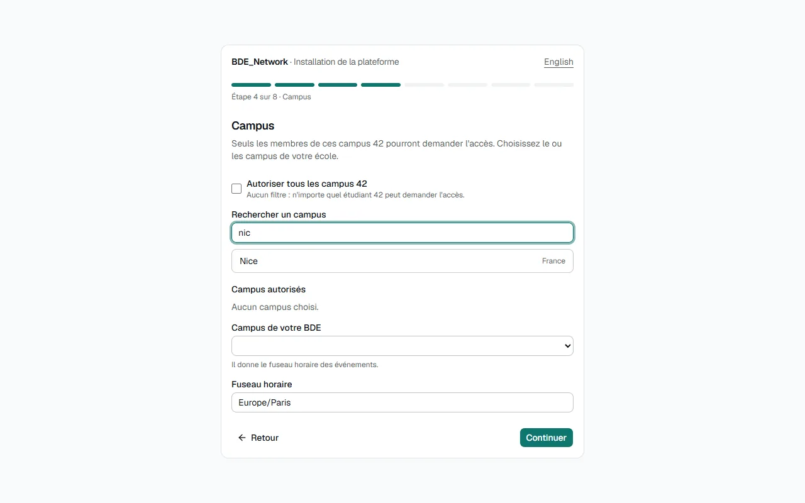
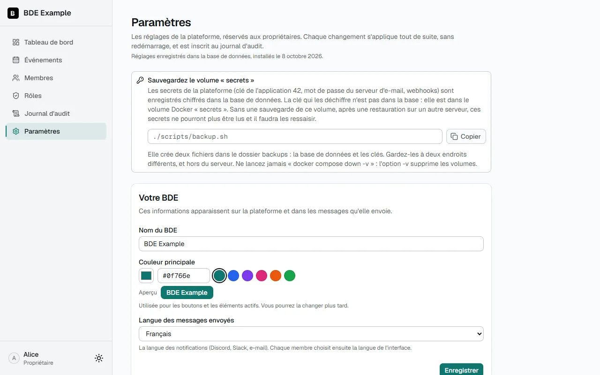

# Installation

Mettre en route la plateforme se fait **dans le navigateur** : vous lancez une commande, vous ouvrez
l'adresse, et une page d'installation vous guide pas à pas. **Vous n'ouvrez aucun fichier de configuration** et
il n'y a **rien à créer avant** (pas de `.env`). Le seul prérequis est **Docker** ; la commande est la même sous
Windows, Linux et macOS, y compris sur un poste où Docker tourne sans droits administrateur (comme les postes
de l'école).

Pour qui ? Pour tout le monde : le bureau peut le lancer lui-même sur son ordinateur pour essayer, et la
personne technique s'en sert sur le serveur ([déploiement](deployment.md)).



---

## À préparer avant

- un compte sur l'**intra 42**, pour créer l'application OAuth (voir
  [plus bas](#créer-lapplication-oauth-sur-lintra-42) : l'installateur vous donne les valeurs à remplir) ;
- les **logins 42** des propriétaires (les personnes qui auront tous les droits) ;
- si vous voulez des notifications : une **URL de webhook** Discord ou Slack, ou les réglages d'un serveur
  e-mail (SMTP). Discord est l'option la plus simple ; pour Slack, un lien pré-rempli est fourni
  ([détails](notifications.md#slack)). Tout cela peut aussi se faire plus tard, dans **Paramètres**.

## 1. Installer Docker et Git

| Outil                                                 | Windows                                                                                        | Linux                                                        | macOS                                                             |
| ----------------------------------------------------- | ---------------------------------------------------------------------------------------------- | ------------------------------------------------------------ | ----------------------------------------------------------------- |
| Docker Desktop (ou Docker Engine + Compose sur Linux) | [Docker Desktop](https://www.docker.com/products/docker-desktop/), avec le backend WSL2 activé | `docker` + `docker compose` (paquet `docker-compose-plugin`) | [Docker Desktop](https://www.docker.com/products/docker-desktop/) |
| Git                                                   | [git-scm.com](https://git-scm.com/) ou `winget install Git.Git`                                | gestionnaire de paquets de votre distribution                | `brew install git` ou Xcode Command Line Tools                    |

Sous Windows et macOS, **lancez Docker Desktop** et attendez qu'il indique qu'il tourne (sous Windows, activez
WSL2 si Docker Desktop le demande : `wsl --install` dans un PowerShell administrateur, puis redémarrez).
Vérifiez :

```
git --version
docker compose version
```

Pas besoin de Node.js.

## 2. Récupérer le code

```
git clone https://github.com/<votre-fork>/BDE_Network.git
cd BDE_Network
```

## 3. Démarrer la plateforme

Depuis le dossier `BDE_Network` (PowerShell, Terminal macOS ou Linux, c'est identique) :

```
docker compose up
```

**Sans `-d` la première fois** : le terminal reste ouvert et affiche ce que fait la plateforme, ce qui permet de
voir le code d'installation. La première fois, Docker construit l'image (quelques minutes), puis le terminal
affiche un encadré comme celui-ci :

```
╔════════════════════════════════════════════════════════════════════════════╗
║  INSTALLATION DE LA PLATEFORME  ·  PLATFORM SETUP                          ║
║                                                                            ║
║  1. Ouvrez / Open :              http://localhost:3000                     ║
║  2. Code d'installation / Code : K7QM-4XPD                                 ║
║                                                                            ║
║  (Ce code change à chaque démarrage. / This code changes at every start.)  ║
╚════════════════════════════════════════════════════════════════════════════╝
```

Si vous avez fermé le terminal ou lancé la commande avec `-d`, vous retrouvez l'encadré :

- dans **Docker Desktop**, onglet **Containers**, cliquez sur le conteneur `app` puis sur l'onglet **Logs** ;
- ou avec la commande `docker compose logs app`.

## 4. Ouvrir la page et suivre les étapes

Ouvrez l'adresse de l'encadré dans votre navigateur. La page demande le **code d'installation** : recopiez celui
de l'encadré. Le code **change à chaque redémarrage** de la plateforme : prenez toujours le dernier affiché. La
page est disponible en **français et en anglais** (lien en haut à droite), une étape à la fois, avec une barre de
progression et un bouton **Retour**.

| Étape | Ce que vous indiquez        | Ce que fait la page                                                                                                                                                 |
| ----- | --------------------------- | ------------------------------------------------------------------------------------------------------------------------------------------------------------------- |
| 1     | Nom du BDE, couleur, langue | Un aperçu de la couleur ; vérifie chaque réponse tout de suite.                                                                                                     |
| 2     | Adresse de la plateforme    | Propose l'adresse que vous utilisez. Elle sert aux liens des notifications et à **l'URL de redirection exacte** à déclarer sur l'intra 42. Prévient pour `http://`. |
| 3     | Application OAuth 42        | Donne le pas à pas et l'adresse à copier (bouton **Copier**), demande l'**UID** et le **secret**, et les **vérifie tout de suite auprès de l'API 42**.              |
| 4     | Campus autorisés            | Propose la **liste des campus 42** avec une recherche (accents ignorés) ; en déduit le fuseau horaire.                                                              |
| 5     | Propriétaires               | Demande les logins 42 et **vérifie qu'ils existent** sur l'intra.                                                                                                   |
| 6     | Module Événements           | Activé par défaut (calendrier, agenda synchronisé, rappels).                                                                                                        |
| 7     | Notifications (facultatif)  | Discord, Slack, e-mail ou rien. Avec un webhook ou un serveur SMTP, un bouton **envoie un message de test**.                                                        |
| 8     | Récapitulatif               | Montre tout (les secrets restent masqués) ; **Installer la plateforme** enregistre.                                                                                 |

Les réponses sont gardées par la plateforme le temps de l'installation : recharger la page ne fait rien perdre.
Les secrets saisis (clé 42, mot de passe SMTP, webhooks) **ne sont jamais renvoyés au navigateur** et sont
**chiffrés** quand ils sont enregistrés. Le **secret de session** et le **mot de passe de la base de données**
sont **générés automatiquement** : vous ne les voyez ni ne les tapez jamais.

### Créer l'application OAuth sur l'intra 42

La connexion se fait uniquement avec les comptes 42 : la plateforme a besoin d'une « application »
déclarée sur l'intra, qui donne deux valeurs (un **UID** et un **secret**). L'étape 3 vous affiche l'adresse de
redirection à copier ; voici le détail du formulaire :

1. Connectez-vous à l'intra 42, puis ouvrez <https://profile.intra.42.fr/oauth/applications/new>.
2. Remplissez le formulaire :

   | Champ        | Valeur                                                                                             |
   | ------------ | -------------------------------------------------------------------------------------------------- |
   | Name         | Le nom de votre BDE (il est montré aux membres au moment d'autoriser la connexion)                 |
   | Type         | **Campus Tool**                                                                                    |
   | Description  | Une phrase, par exemple « Plateforme de gestion du BDE »                                           |
   | Website      | L'adresse de votre plateforme (`https://bde.exemple.fr`, ou `http://localhost:3000` pour un essai) |
   | Redirect URI | **`https://bde.exemple.fr/api/auth/callback/42-school`** — voir ci-dessous                         |
   | Scopes       | **`public`** seulement (c'est le défaut)                                                           |

3. **L'URL de redirection doit être exacte**, au caractère près : l'adresse du site (même
   `http`/`https`, même nom de domaine, même port) **suivie de** `/api/auth/callback/42-school`.
   Sans barre oblique finale. Pour un essai sur votre ordinateur :
   `http://localhost:3000/api/auth/callback/42-school`. Vous pouvez en déclarer plusieurs (une par
   ligne) pour garder l'essai local en plus de la production.
4. Validez. Sur la page de l'application, recopiez l'**UID** et le **SECRET** (cliquez sur l'œil pour
   l'afficher) dans l'étape 3 de l'installateur.

> **Le secret expire.** Sa date d'expiration est affichée sur la page de l'application. Le jour
> où il expire, **plus personne ne peut se connecter** (erreur `invalid_client`). Notez cette date
> dans un agenda ; avant, générez un nouveau secret sur la même page et collez-le dans **Paramètres**,
> section Application 42 (un propriétaire encore connecté voit d'ailleurs un bandeau d'alerte quand 42 refuse
> l'application).

Si en cliquant sur « Se connecter avec 42 » l'intra répond **« The redirect URI included is not
valid »** (ou `redirect_uri_mismatch`) : l'URL de redirection de l'application ne correspond pas
exactement à celle que la plateforme envoie. Comparez-les : le message d'erreur de l'intra montre
l'adresse reçue, et c'est celle-ci qu'il faut déclarer (http au lieu de https ? `www.` en trop ?
port oublié ? barre finale ?).

## 5. Finir

La page « Plateforme installée » apparaît. Il reste deux choses :

1. **Passer en arrière-plan.** Si vous avez lancé `docker compose up` sans `-d`, appuyez sur **Ctrl+C** dans le
   terminal, puis lancez :

   ```
   docker compose up -d
   ```

   La plateforme tourne alors sans garder le terminal ouvert (et redémarre toute seule avec l'ordinateur).

2. **Se connecter avec 42.** Le bouton **Se connecter avec 42** ouvre la page de connexion. Les propriétaires
   de la liste ont tous les droits dès leur première connexion ; les autres personnes demandent l'accès et un
   propriétaire les valide.

**Sauvegardez le volume `secrets`** (`./scripts/backup.sh`, voir
[Sauvegardes et restauration](deployment.md#sauvegardes-et-restauration)) : c'est lui qui contient la clé qui
déchiffre les secrets enregistrés. Sans lui, après une restauration sur un autre serveur, il faudrait les ressaisir.

### La sécurité de la page d'installation

Tant que la plateforme n'est pas installée, n'importe qui qui joindrait l'adresse pourrait l'installer et
choisir les propriétaires. Trois protections :

- **le code d'installation**, affiché dans les journaux du serveur, là où seule la personne qui lance la
  plateforme regarde. 8 caractères sans ambiguïté (pas de 0/O ni de 1/I/L), nouveau à chaque démarrage, gardé en
  mémoire seulement ;
- **un verrouillage** : 5 mauvais essais bloquent la saisie un moment (30 secondes, puis 1 minute, 2 minutes…
  jusqu'à 15 minutes). On peut retarder l'installation en essayant des codes, jamais le deviner ; redémarrer la
  plateforme donne un nouveau code ;
- **rien n'est montré sans le code** : avant, la page ne montre que le champ du code, et le reste du site
  répond « pas installé ».

Une fois l'installation terminée, **la page d'installation disparaît définitivement** (elle répond « introuvable »)
et il n'existe aucun bouton pour la rouvrir. Si l'adresse est en `http://` et n'est pas votre ordinateur, la page
prévient que les secrets circuleraient en clair : placez la plateforme derrière un proxy HTTPS
([guide de déploiement](deployment.md)).

## Après l'installation : Paramètres et rôles

Connectez-vous avec 42 : comme votre login est dans la liste des propriétaires, vous avez directement tous les
droits. Ensuite, **sans toucher à un fichier** :

1. **Paramètres** (menu de gauche, propriétaires seulement) : tout ce que l'installateur a demandé se modifie
   ici, section par section, et s'applique tout de suite. Vous y ajoutez ou retirez des propriétaires, changez la
   clé de l'application 42 quand elle expire, ou réglez les notifications
   ([détails](configuration.md#la-page-paramètres)).

   

2. **Rôles** : deux rôles existent déjà, _Admin_ (tous les droits) et _Membre_ (consulter les événements).
   Créez les vôtres : Président, Trésorier, Responsable événements… en cochant ce que chacun peut faire
   ([détails](roles.md)).
3. **Membres** : chaque personne qui se connecte pour la première fois arrive « en attente » ; vous
   l'approuvez et choisissez son rôle.
4. **Événements** : créez le premier événement, et proposez à chacun de [synchroniser son
   agenda](events.md).

## Mise en production

Pour que les membres y accèdent : un serveur, un nom de domaine et un proxy HTTPS (Caddy,
nginx…). La plateforme n'écoute volontairement que sur la machine elle-même ; le proxy la montre
au monde en HTTPS. Tout est dans [le guide de déploiement](deployment.md), sauvegardes comprises.

## Arrêter / réinitialiser

```
docker compose down          # arrête les conteneurs, conserve les données
docker compose down -v       # arrête et supprime aussi les données (la base ET les clés)
```

Après `docker compose down -v`, tout est effacé : au prochain `docker compose up`, la page d'installation
revient avec un nouveau code.

## Vous aviez une installation par fichiers ?

Une plateforme installée avec `.env` et `bde.config.yml` (avant la page d'installation) n'a rien à refaire :
au premier démarrage après la mise à jour, ces deux fichiers sont **copiés dans la base de données**, secrets
chiffrés, et la page **Paramètres** devient utilisable. Voir [Configuration](configuration.md).

---

## Problèmes fréquents

**Pas d'encadré dans le terminal, ou la page d'installation ne s'ouvre pas**

Attendez la fin de la construction de l'image (quelques minutes la première fois), puis `docker compose logs app`.
Une plateforme déjà installée n'affiche pas d'encadré : c'est normal.

**« Ce code n'est pas le bon » / « Trop d'essais »**

Prenez le **dernier** code affiché : il change à chaque redémarrage (`docker compose logs app` le montre). Après
trop d'essais, patientez le temps indiqué, ou redémarrez : `docker compose restart app` (nouveau code, saisie
débloquée).

**La page d'installation redemande le code**

La session d'installation (2 heures) a pris fin, ou la plateforme a redémarré : entrez le nouveau code ; vos
réponses sont à refaire.

**« 42 refuse ces identifiants » (`invalid_client`)**

L'UID et le secret ne forment pas une paire valide : copiez-les à nouveau depuis la page de l'application sur
l'intra (un espace en trop ou un caractère manquant suffit), vérifiez que le secret n'a pas expiré ni été
régénéré, et qu'ils viennent de la **même** application.

**« L'API 42 est injoignable »**

L'ordinateur n'a pas accès à Internet (ou l'API 42 est en panne). Vous pouvez continuer sans la vérification :
les campus se tapent alors à la main, et les identifiants ne sont pas testés.

**Le site affiche une page « … à corriger » ou « … ne répond pas » (erreur 503) au lieu de la plateforme**

C'est voulu : la plateforme n'a pas pu démarrer, et elle le dit au lieu de redémarrer sans fin. La page nomme le
problème et donne les commandes à lancer ; le détail complet est dans `docker compose logs app`. Les cas :

| La page dit…                                      | Cause                                                                                                                                                                                        | À faire                                                                                                                                                            |
| ------------------------------------------------- | -------------------------------------------------------------------------------------------------------------------------------------------------------------------------------------------- | ------------------------------------------------------------------------------------------------------------------------------------------------------------------ |
| « La base de données refuse la connexion »        | Le volume `secrets` a été supprimé ou remplacé (par exemple par `docker compose down -v`, qui supprime aussi les données), ou `POSTGRES_PASSWORD` a changé **après** la création de la base. | Restaurez l'archive des clés (`scripts/restore.sh … --secrets …`). Sinon, remettez dans `.env` les valeurs de départ de `POSTGRES_*`, puis `docker compose up -d`. |
| « La base de données ne répond pas »              | La base n'est pas (encore) démarrée : normal une minute après un redémarrage du serveur. La page se rafraîchit seule.                                                                        | Si cela dure : `docker compose ps`, puis `docker compose logs postgres`.                                                                                           |
| « La mise à jour de la base de données a échoué » | Une migration n'a pas pu s'appliquer. Le code affiché (`P3009`…) aide à chercher.                                                                                                            | Ne supprimez rien ; lisez `docker compose logs app` ; au besoin restaurez la dernière sauvegarde (voir [le guide de déploiement](deployment.md)).                  |
| « Un réglage … est à corriger »                   | Une installation par fichiers dont `.env` ou `bde.config.yml` est incomplet ou invalide (la page liste les **noms** des réglages, jamais leurs valeurs).                                     | Corrigez le fichier, puis `docker compose up -d --build` ([détails](configuration.md#remplacer-les-réglages-par-les-fichiers)).                                    |

**« Connexion avec 42 momentanément impossible » sur la page de connexion**

42 refuse l'identifiant (UID) ou la clé secrète de l'application du BDE : la clé a expiré ou a été régénérée sur
l'intra. Un propriétaire encore connecté la met à jour dans **Paramètres**, section Application 42 (la clé actuelle
est sur <https://profile.intra.42.fr/oauth/applications>). Si plus personne n'est connecté, voir
[Configuration](configuration.md#la-page-paramètres) : la personne qui gère le serveur peut la remettre avec
`BDE_REIMPORT=settings`.

**« Connexion refusée » après avoir autorisé sur l'intra**

- _« Votre campus 42 (…) n'est pas autorisé »_ : le campus de la personne n'est pas dans la liste des campus
  autorisés. Un propriétaire l'ajoute dans **Paramètres**, section Campus (liste vide = tous les campus). Le nom
  doit être écrit comme sur l'intra (`Nice`, `Paris`…), la casse est sans importance.
- _« Profil 42 incomplet »_ : le compte 42 n'a pas d'e-mail, de campus ou de login visible. Cela
  se règle sur l'intra, pas ici.

**Je me connecte mais je suis « en attente » alors que je devrais être propriétaire**

Votre login n'est pas dans la liste des propriétaires (faute de frappe à l'installation ?). Un autre propriétaire
l'ajoute dans **Paramètres**, section Propriétaires. S'il n'y en a pas, voir
[Configuration](configuration.md#remplacer-les-réglages-par-les-fichiers).

**`Bind for … failed: port is already allocated`**

Un autre programme de l'ordinateur utilise déjà le port 3000. Créez un fichier `.env` à la racine du projet avec
`APP_PORT=3001` (ou un autre port libre), relancez `docker compose up`, et utilisez ce port dans l'adresse et dans
l'URL de redirection de l'application 42.

**`Cannot connect to the Docker daemon` / `failed to connect to the docker API`**

Docker n'est pas démarré. Sous Windows et macOS, **lancez Docker Desktop** et attendez que son
icône indique qu'il tourne ; sous Linux, `sudo systemctl start docker`.

**Tout le monde est déconnecté, ou une page boucle, après un changement de clé de session**

C'est normal : les sessions sont signées avec cette clé (dans le volume `secrets`), les anciennes ne valent plus
rien. Chacun se reconnecte (si la page boucle, supprimer les cookies du site règle tout).

**L'application redémarre en boucle avec « bde.config.yml est introuvable »** (installation par fichiers)

Le fichier est copié dans l'image pendant la construction (`docker compose up --build -d`), avec vos propres
droits. S'il est absent, vide, illisible ou invalide, la plateforme n'est plus en boucle : elle affiche une page
« à corriger » et son journal (`docker compose logs app`) nomme le cas, le chemin vérifié et ce qu'il faut faire.
Si un **dossier** `bde.config.yml` traîne dans le projet (laissé par un ancien montage raté), supprimez-le
(`rmdir bde.config.yml`) puis `docker compose up -d --build`. Pour voir ce que le conteneur lit réellement, depuis le
dossier du projet, sous Linux ou macOS :

```
docker compose run --rm --no-deps -v "$PWD":/hote:ro --entrypoint sh app -c 'echo "== conteneur =="; id; ls -ld /app/bde.config.yml; head -n 3 /app/bde.config.yml 2>&1; echo "== dossier du projet vu par le démon Docker =="; ls -la /hote'; echo "== Docker =="; docker info --format 'securite={{.SecurityOptions}} hote={{.Name}}'; echo "DOCKER_HOST=$DOCKER_HOST"; echo "== machine =="; ls -ld bde.config.yml; pwd
```

| Ce que vous voyez                                                          | Signification                                                                  |
| -------------------------------------------------------------------------- | ------------------------------------------------------------------------------ |
| `head: /app/bde.config.yml: Permission denied`                             | Le fichier est là mais l'application (`uid=1001`) n'a pas le droit de le lire. |
| `drwx… /app/bde.config.yml` et `Is a directory`                            | Le montage a laissé un dossier à la place du fichier.                          |
| `-rw… nextjs … /app/bde.config.yml` et les premières lignes du fichier     | Le conteneur lit sa configuration : tout va bien.                              |
| La liste sous « vu par le démon Docker » est vide ou sans `bde.config.yml` | Le démon ne voit pas votre dossier : aucun montage ne pouvait marcher.         |
| `securite=[… name=rootless …]`                                             | Docker tourne sans droits administrateur.                                      |

**Le site n'est pas joignable depuis un autre ordinateur**

C'est voulu : l'application n'écoute que sur la machine elle-même (`127.0.0.1`). En production c'est le
proxy HTTPS qui l'expose ([déploiement](deployment.md)).

**Windows : lenteur au démarrage**

La première synchronisation de fichiers par Docker Desktop est plus lente que sous Linux ;
les lancements suivants sont rapides.

Pour un environnement de contribution avec rechargement à chaud, voir
[le guide contributeur](contributing-guide.md).
