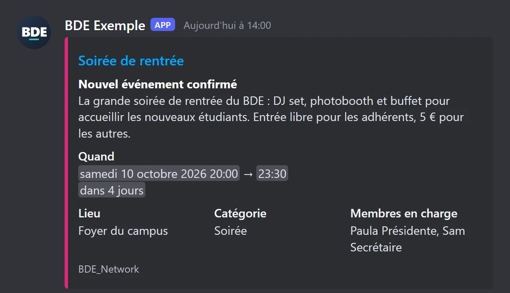
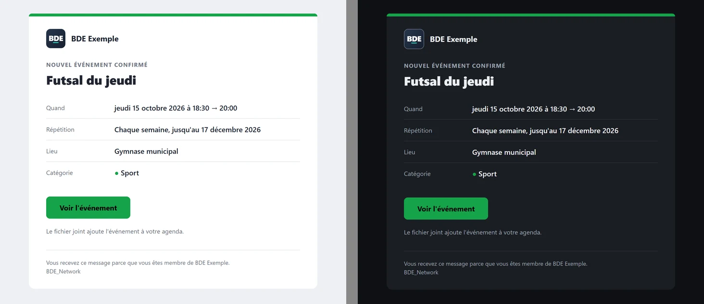

# Notifications

La plateforme prévient le BDE par **email**, par un salon **Discord**, par un salon **Slack**, ou
pas du tout. Le canal se choisit **par type de notification** dans la section `notifications` de
`bde.config.yml` (voir [Configuration](configuration.md#notifications)) ; les identifiants du canal
(SMTP, URL de webhook) sont dans `.env`.

| Notification     | Quand                                             | Couleur de la carte Discord                                 |
| ---------------- | ------------------------------------------------- | ----------------------------------------------------------- |
| `memberPending`  | un nouveau membre demande l'accès                 | ambre                                                       |
| `memberApproved` | une demande est approuvée                         | vert                                                        |
| `memberRemoved`  | un membre est retiré du BDE                       | rouge                                                       |
| `eventConfirmed` | un événement est confirmé                         | celle de **la catégorie** de l'événement (`bde.config.yml`) |
| `eventReminder`  | rappel la veille (ou le jour même, voir plus bas) | celle de la catégorie                                       |

Slack garde un message en texte. Discord a ses cartes, l'e-mail sa propre mise en page : voir [Le rendu sur Discord](#le-rendu-sur-discord) et [Les e-mails](#les-e-mails).

## Le rendu sur Discord

Sur Discord, chaque notification est une **carte** (un _embed_) :

_Illustration dessinée à partir de la vraie carte envoyée par la plateforme ; Discord l'affiche avec
sa propre police et selon le thème de chaque lecteur._

- **Barre de couleur** : la couleur de la catégorie pour un événement ; ambre, vert ou rouge pour une
  demande, une approbation, un retrait. Ces trois teintes restent lisibles sur le thème clair comme
  sur le thème sombre de Discord.
- **Titre cliquable** vers la page concernée (l'événement, ou la page _Membres_), **sans** carte
  d'aperçu en double. Sans `APP_URL`, le titre n'est simplement pas un lien.
- **Champs en colonnes** : _Quand_ sur toute la largeur, puis _Lieu_, _Catégorie_ et _Membres en
  charge_ côte à côte. Une série récurrente ajoute une ligne _Répétition_.
- **Dates au format Discord** : chaque lecteur les voit **dans son propre fuseau horaire et sa
  propre langue**, avec un compte à rebours (« dans 3 jours ») qui se met à jour tout seul, sans que
  le message soit modifié.
- **Expéditeur** : le message arrive au nom du BDE (`bde.name`) avec son logo en avatar.
- **Membres** : la photo 42 de la personne en vignette, son rôle, et **qui** a fait l'action
  (« Approuvé par … », « Retiré par … »).
- **Pied de carte** discret : `BDE_Network`.
- **Rappel** : « Rappel · demain » en temps normal ; « Rappel · aujourd'hui » quand le rappel part le
  jour même de l'événement (serveur éteint à l'heure habituelle, voir
  [le rappel de la veille](events.md#comment-fonctionne-le-rappel-de-la-veille)).

La description d'un événement est reprise **sur 350 caractères au plus** (coupée proprement, avec
« … ») : la carte est un avis, la page de l'événement a le détail. Plus généralement, tout texte trop
long pour Discord est coupé plutôt que de faire refuser le message.

### Sécurité des textes

Un titre, un lieu ou un nom viennent de membres : `@everyone`, `@here`, `<@123…>` ou `<!channel>` y
sont rendus **inoffensifs** (ils s'affichent comme du texte, personne n'est notifié), dans la carte
comme dans le nom de l'expéditeur, et chaque envoi interdit toute mention (`allowed_mentions`).

## Le logo de l'expéditeur

Discord va **chercher lui-même** l'image à l'adresse indiquée : elle doit donc être publique et dans
un format qu'il accepte.

|                       |                                                                                           |
| --------------------- | ----------------------------------------------------------------------------------------- |
| **Formats acceptés**  | PNG, JPEG, GIF, WebP. **Pas le SVG** (c'est le format du logo par défaut de l'interface). |
| **Taille conseillée** | carré, 512 × 512 px (128 px au minimum), moins de 8 Mo                                    |
| **Forme**             | Discord l'affiche **en rond** : gardez l'essentiel au centre, loin des coins              |

La plateforme choisit l'image ainsi :

1. si `bde.logoPath` pointe vers un PNG, JPEG, GIF ou WebP, c'est lui ;
2. sinon (SVG, par exemple), le fichier **`public/logo.png`**, fourni avec la plateforme (un monogramme
   « BDE » neutre).

**Pour mettre le logo de votre BDE** : remplacez `public/logo.png` par votre image (même nom), ou
déposez-la dans `public/` sous un autre nom et réglez `logoPath` (`logoPath: '/mon-logo.png'`).
Le logo est alors aussi celui de l'interface. Reconstruisez ensuite l'image
(`docker compose up --build`, voir [Configuration](configuration.md)).

Si Discord ne peut pas récupérer l'image, **le message part quand même**, au nom du BDE et sans
avatar : jamais d'image cassée. C'est le cas quand :

- `APP_URL` n'est pas renseignée, ou n'est pas une adresse publique (`localhost`, un réseau privé :
  Discord ne les voit pas). Renseignez par exemple `APP_URL=https://bde.exemple.fr` dans `.env` ;
- le fichier est introuvable, ou le serveur ne le sert pas comme une image.

La plateforme vérifie l'image (une requête rapide, mémorisée dix minutes) avant de l'envoyer, pour ne
pas afficher d'avatar cassé.

Le **même logo** sert à l'en-tête des e-mails (Gmail et Outlook n'affichent pas non plus le SVG). Là, l'adresse
n'a pas besoin d'être publique : c'est le logiciel de messagerie de la personne qui charge l'image (un BDE sur
réseau privé verra son logo dans les e-mails, pas dans Discord).

> **Nom du BDE** : Discord refuse un nom d'expéditeur qui contient « discord » ou « clyde ». Dans ce
> cas le message part sous le nom du webhook (celui défini dans les paramètres du salon).

## Les e-mails

Un e-mail est une vraie page mise en forme, avec une **version texte** pour les clients qui n'affichent
pas le HTML :

_Confirmation d'une série d'événements. À gauche, en mode clair ; à droite, le même e-mail en mode sombre
(capture du rendu dans Mailpit)._

- **En-tête** : le logo du BDE et son nom (le logo de la section précédente ; à défaut de logo
  accessible, le nom seul). En mode sombre, un fin liseré clair entoure le logo pour qu'il ne se fonde
  pas dans la carte.
- **Barre et bouton de la couleur de la catégorie** de l'événement (ambre, vert, rouge pour les
  demandes, approbations) ; le texte du bouton est noir ou blanc selon la couleur, pour rester lisible.
- **Lignes** _Quand_, _Répétition_, _Lieu_, _Catégorie_ (avec sa pastille de couleur) et _Membres en
  charge_ ; **un bouton** vers la page concernée (l'événement, ou la page _Membres_) — absent si
  `APP_URL` n'est pas renseignée.
- **Texte d'aperçu** (_preheader_) : ce que la boîte de réception montre à côté de l'objet (« Nouvel
  événement confirmé · samedi 10 octobre à 20:00 · Foyer du campus »).
- **Pied discret** : pourquoi la personne reçoit ce message, et `BDE_Network`.
- **Confirmation d'un événement : le fichier `.ics` est joint.** Les clients mail proposent alors
  « Ajouter à l'agenda » ; il contient toutes les dates à venir d'une série, avec les mêmes
  identifiants que les agendas à abonnement (rien n'est ajouté en double). Le rappel n'en joint pas.
- **Rappel** : « Rappel · demain » ou « Rappel · aujourd'hui » (voir plus haut).
- **Membres** : la demande d'accès (avec la photo 42, au salon ou aux personnes qui gèrent les
  membres) et l'approbation (message de bienvenue à la personne, avec son rôle et un bouton pour se
  connecter). Un retrait **n'envoie jamais d'e-mail**.
- **Langue** : celle de `bde.defaultLocale` (français ou anglais), pour tous les textes.

Tout ce qu'un membre a saisi (titre, lieu, nom…) est **échappé** avant d'entrer dans la page : il
s'affiche comme du texte, jamais comme du code.

**Compatibilité.** Mise en page en tableaux, styles écrits dans chaque élément, bouton « blindé » pour
Outlook sur Windows (qui affiche les e-mails avec le moteur de Word), mode sombre prévu pour Apple Mail,
Gmail et Outlook, et affichage adapté aux petits écrans (les lignes s'empilent). Mailpit vérifie chaque
e-mail contre les clients mail courants (onglet _HTML Check_) : environ 94 % des propriétés CSS utilisées
sont acceptées partout, le reste (coins arrondis, par exemple) est un simple embellissement qui disparaît
sans rien casser.

## Tester les e-mails en développement (Mailpit)

`docker-compose.dev.yml` lance **Mailpit**, une boîte mail de test : l'application lui envoie tous les
e-mails, **aucun ne sort de votre machine**, même avec de vraies adresses de membres. C'est branché par
défaut, sans rien régler.

1. Démarrez l'environnement : `docker compose -f docker-compose.dev.yml up`.
2. Dans `bde.config.local.yml` (ou `bde.config.yml`), mettez le canal voulu sur `email`, par exemple
   `eventConfirmed: 'email'`, puis redémarrez l'application (la configuration est lue au démarrage).
3. Déclenchez la notification (confirmez un événement, approuvez un membre…) et ouvrez
   **<http://localhost:8025>**.

Mailpit montre le rendu HTML (avec un aperçu ordinateur, tablette, téléphone), la version texte, les
en-têtes, les pièces jointes (le `.ics`) et un test de compatibilité par client mail. Les messages sont
perdus quand le conteneur s'arrête. Pour que le logo s'affiche, `APP_URL` doit être renseignée
(`APP_URL=http://localhost:3000` en développement).

Pour envoyer par un vrai serveur SMTP depuis votre poste de dev plutôt que vers Mailpit, renseignez dans
`.env` `DEV_SMTP_HOST`, `DEV_SMTP_PORT`, `DEV_SMTP_FROM` (et `DEV_SMTP_USER`, `DEV_SMTP_PASSWORD`) : ils
remplacent les valeurs de Mailpit. En production (`docker-compose.yml`), Mailpit n'existe pas : c'est le
`SMTP_*` de votre `.env`.

## Dépannage

| Constat                          | Cause probable                                                                                     |
| -------------------------------- | -------------------------------------------------------------------------------------------------- |
| E-mail sans logo                 | `APP_URL` absente, ou le logo n'est pas servi comme une image (le nom du BDE s'affiche à la place) |
| Pas d'avatar, mais le nom du BDE | `APP_URL` absente ou locale, ou logo non servi comme une image (voir plus haut)                    |
| Le titre n'est pas cliquable     | `APP_URL` n'est pas renseignée                                                                     |
| Un message n'arrive pas          | regardez les journaux du serveur : `docker compose logs app` (lignes `[events]`, `[members]`)      |
| Tous les messages échouent       | `DISCORD_WEBHOOK_URL` absente, mal copiée, ou webhook supprimé dans le salon                       |
